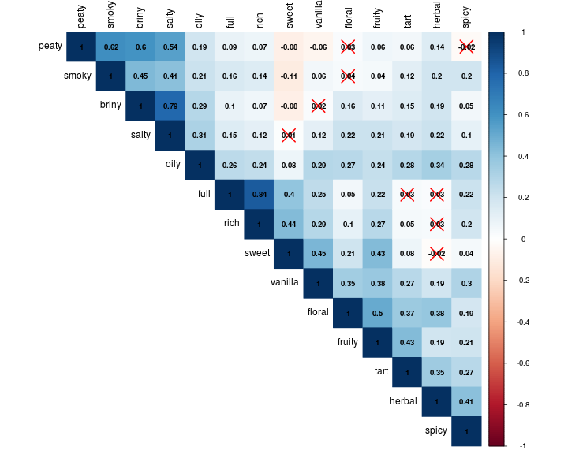
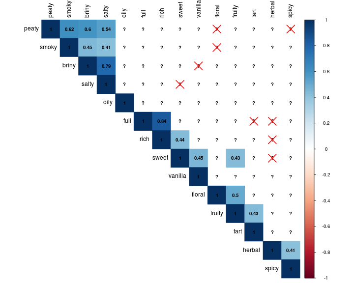
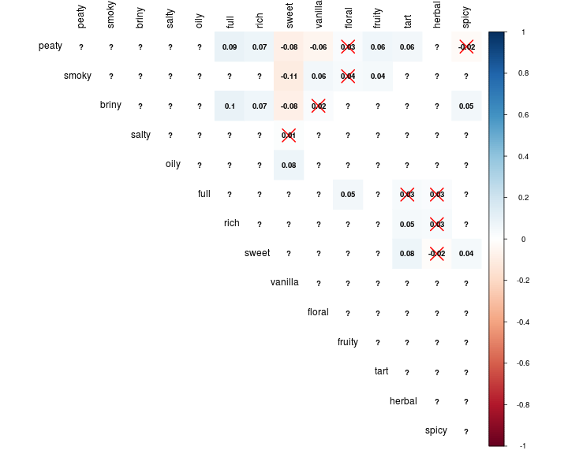
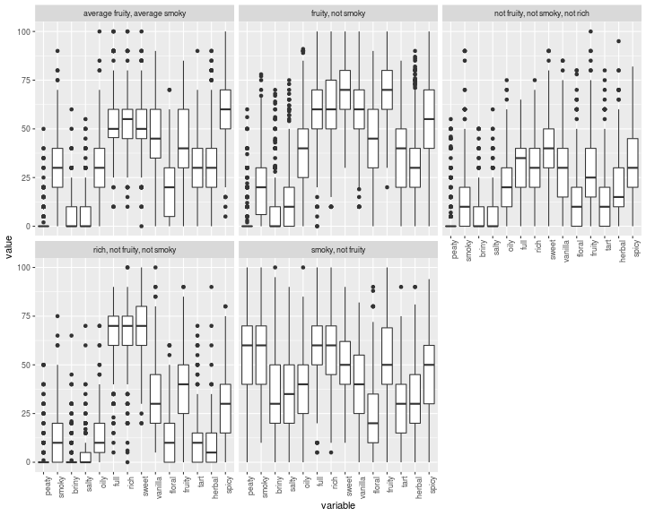

<p>

If data collection can be described as preparing a gift, then exploratory data analysis (EDA) is like opening the box. Generally, you can guess what's inside based on some knowledge and experience, but the interesting part is that it never ceases to surprise you no matter how well informed you are.

Since I do not have any existing user profiles or ratings, a knowledge-based [recommender system](https://en.wikipedia.org/wiki/Recommender_system) is the only choice. Such a system usually requires the construction of an item characteristic space, a linking mechanism to translate user input into this space and a way to search and rank items. It is largely a matrix completion, searching and ranking problem where a lot of methods can be used. But in this section, we focus on the exploration of datasets.

To build a knowledge-based recommender system, the data collected should contain items (whiskies) and their properties. For whiskies, a large amount of information can be extracted and utilized, but what matters most on the purchase decision given a similar budget range are the tastings (flavors) and public opinions (ratings). For general knowledge of whisky, please refer to Ideas Behind - Background.

In order to acquire such properties, which, in other words, means the quantification of flavors, I tried text mining on whisky reviews but it turned out to be a poor idea. The reasons are:

- The contents of whisky reviews vary a lot, from short comments describing flavors to a several pages article introducing the history and personal stories.
- Useful reviews are often short, which means terms that describe the most distinguished flavor may only appear once. Methods like term frequency can be used but may eventually result in a unitary matrix where flavors with different significant levels are given the same weight. This could cause a loss of information and diversity.
- Whisky vocabulary lacks a database for sentiment analysis, which makes it very hard to predict the writer's opinion simply from a review article.

Due to the reasons above, I chose to obtain data from websites with explicit flavor profiles. It has certain limitations (see Ideas Behind - Limitation), but data acquired in such a way are more accurate and less vulnerable to information loss.

The resulted dataset contains flavors as follows:

- peaty, smoky, briny, salty, oily, full, rich, sweet, vanilla, floral, fruity, tart, herbal, spicy

These flavors range from 0 to 100 where 0 indicates "not a tiny bit at all" and 100 describes "holy cow that's a lot". In the following EDAs, I will use correlation, PCA, clustering, and regression to analyze these flavors and try to find their characteristics.


## Correlation between Flavors

Analyzing the correlation between flavors is a very natural thought after looking at their names. After all, briny and salty look alike while peaty and smoky sound the same.

To conduct this analysis, I extract flavor profiles from the whisky data and run a correlation with a significance test. Then the resulted matrix is visualized where any result with a p-value larger than 0.05 (insignificant in this case) is highlighted with a red cross.

A higher correlation between flavors is colored with a darker blue. And the negative ones are colored in red. It seems colors near the diagonal "1"s are darker. This is because I selectively did so for a better illustration. These colors can be random if the columns happen to be so as well.


```r
df <- read.csv("../data/whisky.csv")
df.profile <- df[, 9:22]
corr <- cor(df.profile)
corr.mtest <- cor.mtest(df.profile)

corrplot(corr,
  method = "color", type = "upper", p.mat = corr.mtest$p, addCoef.col = "black",
  sig.level = .05, pch.col = "red", tl.col = "black", number.cex = .8
)
```



In real practice, I am only concerned with correlations that are either high or low. The below graph only shows correlations no less than 0.4, which confirms my assumptions that peaty and smoky, briny and salty are relatively highly correlated. These words seem to go into several groups, but for now, it's hard to separate them apart.


```r
corr.large <- corr
corr.large[corr.large < 0.4] <- NA

corrplot(corr.large,
  method = "color", type = "upper", p.mat = corr.mtest$p, addCoef.col = "black",
  sig.level = .05, pch.col = "red", tl.col = "black", number.cex = .8
)
```



The next graph visualizes correlations no larger than 0.1, where peaty, smoky, briny and vanilla are lowly correlated with other flavors which means they are quite distinguishable during the tasting. Another reason may be a biased selection of the flavors, see Ideas Behind - Limitation for details.


```r
corr.small <- corr
corr.small[corr.small > 0.1] <- NA

corrplot(corr.small,
  method = "color", type = "upper", p.mat = corr.mtest$p, addCoef.col = "black",
  sig.level = .05, pch.col = "red", tl.col = "black", number.cex = .8
)
```



## PCA & Principal flavors

[Principal component analysis (PCA)](https://en.wikipedia.org/wiki/Principal_component_analysis) is widely used in dimensionality reduction, where correlated variables are converted into linearly uncorrelated ones. Based on the previous analysis, our dataset contains some highly correlated flavors which could possibly be combined into fewer ones. Also, since our brains can only imagine no more than 3 dimensions, this method helps to visualize data as well.

Since such a process is a little abstract, an interpretable description can be:

- I want to know what are the major flavors that matter most during the tasting. I know the result may contain many but let's limit it to using two words to describe a major direction, such as apple and banana as the first and nutty and creamy as the second. In such a way I can convey most characteristics of a whisky using fewer words. An example can be a whisky that is not so apple and banana but very nutty and creamy.

Here I use the same flavor profiles like those I used in the previous section. Here, they are calculated for their PCA rotation, which can also be viewed as the weights on various flavors where more important ones are given higher weights. The top two flavors are selected as the description of this principal component (PC). And only unique flavors that never appear in previous PCs are displayed. The result is:

- Fruity & Floral, Peaty & Smoky, Rich & Full

These are the principal flavors of whiskies, at least according to this dataset. And they explain nearly 60% percent of the total variance which indicates it's feasible to use only three dimensions to describe a whisky's flavor, which is also what I did in Recommender - Flavor Profile and Insight - Cluster.


```r
pca <- prcomp(df.profile)
summary(pca)$importance[3,1:3,drop = F]
```

```
##                           PC1    PC2     PC3
## Cumulative Proportion 0.27711 0.4451 0.57158
```

```r
pca.top <- data.frame()

k <- 2
for (i in seq(dim(pca$rotation)[2])) {
  pca.i <- sort(abs(pca$rotation[, i]), decreasing = T)[1:2]
  names <- names(pca.i)
  pca.top <- rbind(pca.top, data.frame(pc = i, name = names, value = pca.i, unique = !(names %in% pca.top$name)))
}
pca.top[pca.top["unique"] == T,][,-4]
```

```
##         pc    name     value
## fruity   1  fruity 0.4133503
## floral   1  floral 0.3276811
## peaty    2   peaty 0.5246750
## smoky    2   smoky 0.4884919
## rich     3    rich 0.5254929
## full     3    full 0.5206254
## spicy    4   spicy 0.6378590
## oily     5    oily 0.6442631
## vanilla  6 vanilla 0.7707902
## tart     7    tart 0.5618651
## herbal   9  herbal 0.3962581
## sweet   11   sweet 0.6414460
## briny   14   briny 0.7254733
## salty   14   salty 0.6728940
```

## Clustering and Box Plots

Loosely speaking, the previous section can be seen as an effort to cluster flavors. But it is fundamentally different since PCA serves more like a reconstruction or transformation rather than clustering. Also, using two flavors to name a PC is a heuristic choice without a solid proof. And the whole process solely serves for interpretability and visualization.

In this section, whiskies are clustered into five groups using the k-means method. The work is done offline and interpretable names are added to each cluster group for better illustration. These names are derived from the PCA mentioned above which, again, has limitations and cannot fully explain all the flavors. Nevertheless, the below plot still serves as a good example where carefully selected information, even little, can explain a lot.

For readers who are not familiar with box plot, it's actually very intuitive and informative. Majority of the values fall in the box, others fall within the line with only a few outliers indicated with dots. 

These plots represent some interesting patterns on whisky flavors, which, to a certain degree, also defines the drinker groups, where usually a novice starts from not fruity nor smoky, to an intermediate who prefers average smoky and fruity, finally to a connoisseur who seeks either strong smoky or fruity. Generally, drinkers prefer rich and full-bodied whiskies as they provide more tasting levels than delight ones.


```r
df.cluster <- read.csv("../data/cluster.csv")
df.profile["cluster"] <- as.character(df.cluster$cluster.5)

df.melt <- melt(df.profile, id.vars = c("cluster"))

ggplot(df.melt) +
  geom_boxplot(aes(x = variable, y = value)) + 
  facet_wrap(~cluster) + 
  theme(axis.text.x = element_text(angle = 90, hjust = 1))
```



## Predict Ratings based on Flavor

Here is the final section as well as a toy example to demonstrate what could possibly go wrong with the analysis. A tempting question to answer while working on this work is:

- Could flavors predict ratings?

An intuitive answer is "possibly" since there are always market trends. But what if the information provided by the flavors is not enough to make such a prediction, which means either the concept is not well related or the data are insufficient. In order to find out, let's try the linear regression first and see what happens.

The below codes construct a linear regression model and feed the flavors values through it to predict ratings. The RMSE in the testing sample is very pathetic since a whisky rated 85/100 has a decent chance to be predictively rated from 80 to 90, which is not good at all in real practice. Also, the Rsquared is only around 0.24 which indicates there are still a large number of residuals not explained.


```r
set.seed(112358)

data <- df[, c(7, 9:22)]

test.index <- createDataPartition(data$rating, times = 1, p = 0.2, list = F)

train <- data[-test.index, ]
test <- data[test.index, ]

model <- train(rating ~ ., method = "lm", data = train)

prediction <- predict(model, test)
result <- postResample(prediction, test$rating)
result
```

```
##      RMSE  Rsquared       MAE 
## 5.1087236 0.2383038 3.8922672
```

Maybe it's due to the model we selected is linear. Here we try a nonlinear method which improves the accuracy a bit but not much. I also tested other models but they all failed to deliver an acceptable result. This is actually easy to understand. 14 flavor profiles are not sufficient to tell a good whisky from a bad one. Two whisky may share similar profiles but the joy of tasting these flavors may vary a lot.

Indeed, it's very hard to predict ratings solely from the item domain. A feasible way to do this is to use collaborative filtering method. But facing the cold starting problem, this work is not eligible to adopt this method or similar.


```r
model <- svm(rating ~ ., data = train)

prediction <- predict(model, test)
result <- postResample(prediction, test$rating)
result
```

```
##     RMSE Rsquared      MAE 
## 4.597379 0.380137 3.420703
```

## Conclusion

The EDA here presents four different but related analysis providing us with valuable insights of the collected data. It is also the cornerstone to construct a recommender system, without which the structure would simply fall apart.

In real practice, data collection and wrangling take no less (possibly a lot more) time than recommender system building. And what matters most is the quality of data. No matter how good the algorithms are, it's always the truth for the garbage in, then garbage out. The EDA can not turn stone into gold, but it does turn iron into steel if done in the right way.
