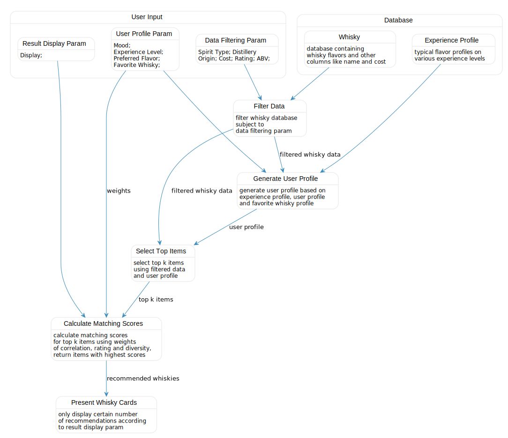

The core feature of this work is the recommender system. And the function it provides is rather simple, i.e. accept user input and offer recommendations. To give a better illustration, I use a state diagram below where a successful recommendation is achived with several steps.

The first step is to selectively pick data according to the filtering parameters from user inputs. These parameters could include spirit type, cost, rating, and abv etc. Then it is necessary to project user input into the item property space, which means we need to find a way to translate these inputs into flavor profiles. This step is done using the user profile parameters as well as some preprocessed data. By doing this, we obtain a user flavor profile so we can measure the similarity between it and items in our database. The most similar items are denoted as top k items and they are passed to another algorithm to generate matching scores, which are calculated considering different weighting sets among correlation, rating, and diversity. The top n items with the highest scores are returned according to the display parameter n. And only those n items are displayed on the screen as the recommendation results.

The diagram below illustrates this process. Also feel free to check codes in my Git Repo posted in About - Resource page for detailed implementations.

